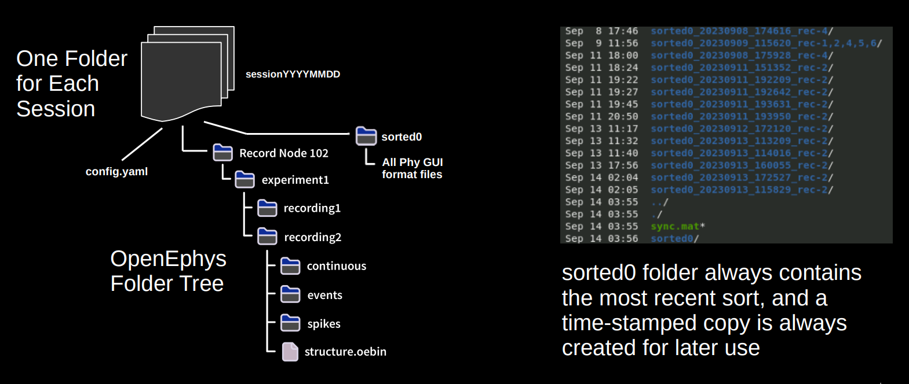

# PixelProcessingPipeline
This toolbox easily and automatically processes Neuropixels and Myomatrix data recorded during experiments.

This toolbox will:
- Automatically generate a config file to keep track of experimental parameters
- For Neuropixel data:
  - Estimate the probe drift over time (Boussard et al. 2021)
  - Perform drift registration using the above estimate with Kilosort 2.5 (ibl pykilosort) and sorting with Kilosort 2.0 
  - Extract and save the sync signal sent from the behavioural task
- For Myomatrix data:
  - Combine OpenEphys data into a single binary and automatically remove broken channels
  - Extract and save the sync signal sent from the behavioural task
  - Perform spike sorting with a modified version of Kilosort 3.0 (wider templates)
  - Combine similar units, calculate motor unit statistics, export back to phy

## Folder Tree Structure

## Installation
### Requirements
Many processing steps require a CUDA capable GPU.
  - For Neuropixel data, a GPU with at least 10GB of onboard RAM is recommended
  - For Myomatrix data, currently only GPUs with compute capability >=5.0 are supported due to shared thread memory requirements

### Instructions
These installation instructions were tested on the Computational Brain Science Group Server 'CBS GPU 10GB' image, and the Compute Canada servers. They may need to be adjusted if running on another machine type.

Clone a copy of the repository on your local machine (for example, in the home directory)

    git clone https://github.com/JonathanAMichaels/PixelProcessingPipeline.git
    
After cloning, you can either configure a virtualenv, conda, or micromamba environment to run the pipeline

#### Micromamba Environment (Option 1, recommended)
To install micromamba and set up a micromamba environment, follow these steps:

    "${SHELL}" <(curl -L micro.mamba.pm/install.sh)
    micromamba env create -f environment.yml
    micromamba activate pipeline

#### Virtual Environment (Option 2)
To set up a virtualenv environment, follow these steps:

    virtualenv ~/pipeline
    source ~/pipeline/bin/activate
    pip install --upgrade pip setuptools wheel
    pip3 install torch torchvision
    pip install scipy ruamel.yaml ibl-neuropixel PyWavelets scikit-image pyfftw==0.12.0 cython pydantic

Install the cupy version that matches your version of nvcc. For example, if running 'nvcc --version'
shows version 10.1, then run

    pip install cupy-cuda101

#### Conda Environment (Option 3, untested)
To set up a conda environment, follow these steps:

    wget https://github.com/conda-forge/miniforge/releases/latest/download/Miniforge3-Linux-x86_64.sh
    bash Miniforge3-Linux-x86_64.sh
    conda init
    conda env create -f environment.yml
    conda activate pipeline

#### Final Installation Steps
If you are processing Myomatrix data, open matlab and confirm that all mex files compile by running
    
    matlab -nodesktop
    cd PixelProcessingPipeline/sorting/Kilosort-3.0/CUDA/
    mexGPUall

Compile codes necessary for drift estimation and install supplementary packages

    cd PixelProcessingPipeline/registration/spikes_localization_registration
    python3 setup.py build_ext --inplace
    pip install -e .

(Optional) Extra step if and only if you're on a canada compute cluster

    module load gcc/9.3.0 arrow python/3.8.10 scipy-stack

## Usage
Organize each experiment into one directory with a Neuropixel folder inside (e.g. 041422_g0), a Myomatrix folder (e.g. 2022-04-14_09-48-02_myo, which must have _myo at the end) and any .kinarm data files generated.
The Myomatrix folder must be organized either as 'folder_myo/Record Node ###/continuous/' for binary open ephys data,
or as 'folder_myo/Record Node ###/***.continuous' for open ephys format data.

#### VirtualEnv Activation
Every time you open a new terminal, you must activate current source. If virtualenv was used, activate the source using

    source ~/pipeline/bin/activate

#### Conda Activation
If a conda environment was used, activate it using

    conda activate pipeline

#### Final Usage Steps
The first time you process an experiment, call

    python pipeline.py -f /path_to_experiment_folder

This will generate a config.yaml file in that directory with all the relevant parameters for that experiment generated automatically. Open that file with any text editor and add any session specific information to the Session parameter section. For example, if you collected Myomatrix data you must specify which channels belong to which electrode and which channel contains the sync information, since this information cannot be generated automatically.

Editing the main configuration file can be done by running the command below:
    
    python pipeline.py -f /path_to_experiment_folder -config

If the config.yaml is correct, you can run the pipeline with all steps, for example

    python pipeline.py -f /path_to_experiment_folder -full

Alternatively, you can call any combination of

    -config
    -registration
    -neuro_config
    -neuro_sort
    -neuro_post
    -myo_config
    -myo_sort
    -myo_post
    -lfp_extract

to perform only those steps. For example, if you are processing Myomatrix data, run

    python pipeline.py -f /path_to_experiment_folder -myo_sort -myo_post

To edit the configuration file for the processing Myomatrix data, run

    python pipeline.py -f /path_to_experiment_folder -myo_config
    
To edit the configuration file for the processing Neuropixel data, run

    python pipeline.py -f /path_to_experiment_folder -neuro_config

## Extensions

This code does not currently process .kinarm files or combine behavioural information with synced neural data. This may be added at a later date.

The Neuropixels registration is based on https://github.com/int-brain-lab/spikes_localization_registration.
