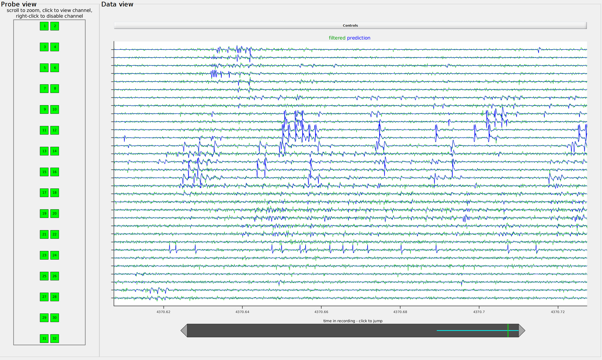

# _[ks25]_ major changes & updates

[ks25] is a heavily-modified version of the Kilosort spike sorting package for Matlab, tailored for the analysis of non-chronic linear array recordings with modest channel counts (~24-100 ch).

Detailed documentation of significant & ongoing changesto the codebase and detailed parameter recommendations can be found in **the [dev_TODOs.md](dev_TODOs.md) document**.

[My **\[ks25\]** branch](https://github.com/czuba/Kilosort) is based on the Kilosort 2.5 codebase, and attempts to marry some of the more successful features of Kilosort 2.0 (i.e. temporally dynamic waveform templates) with backported features & improvements from the newer Kilosort 2.5 & 3.0 (i.e. a modified version of the 'datashift2' drift correction algorithm).

While the original Kilosort package (by [Marius Pachitariu, et al.](http://github.com/MouseLand/Kilosort)) is an amazing resource for fast & accurate spike sorting of high-channel count high-density silicon probes (e.g. [Neuropixels](https://www.biorxiv.org/content/10.1101/2020.10.27.358291v1); ~100s-1,000s ch, ~15-20µm spacing), out-of-the-box results have been less successful with data collected during non-chronic linear array recordings with comparatively broader inter-electrode spacing (e.g. [Plexon U-Probes](https://plexon.com/products/plexon-u-probe/); 24-64 ch, ~50-100µm spacing).GUI updates

## Overview of changes

Using default Kilosort parameters --directly, or with modest adjustments-- to sort non-chronic recordings from 32-channel linear arrays fails to capture spikes that are easily detectible in the raw & filtered data traces (i.e. well above noise of continuous voltage raw data; see github issue [#63](https://github.com/MouseLand/Kilosort/issues/63) for example screenshot of missed high-amplitude spikes). These issues have been persistent since Kilosort 2.0, and remain throughout versions 2.5 & 3.0.

Amongst other updates & revisions, the **[ks25]** adaptation of Kilosort attempts to address two primary sources of missed units:

1. arbitrary inversion of low-rank template representations (consequence of template updating procedure; w/in template learning & extraction: `learnTemplates.m` & `trackAndSort.m`, respectively)
2. inadvertent cancellation of spike waveforms with balanced positive- & negative-going components (consequence of template alignment w/in `mexSVDsmall2.cu`)
   - fix for this necessitated abandoning the ambiguous nature of aligning spikes to _either peak or valley_ (issue [#221](https://github.com/MouseLand/Kilosort/issues/221))
   - *all templates* are now aligned to the _minimum_ value

Over batches & learning, these two errors result in spurrious batch-sized stuttering of spike detection (github issue [#60](https://github.com/MouseLand/Kilosort/issues/60), [#175](https://github.com/MouseLand/Kilosort/issues/175)), and errrant temporal shifts & polarity inversions that accumulate to missed and/or inadvertently dropped high-amplitude spike templates.

In the process, significant changes have been made to the raw file handling & batch processing (addresses bug reported in issue [#219](https://github.com/MouseLand/Kilosort/issues/219)), `datashift`  drift correction estimation (including fix described in issue [#394](https://github.com/MouseLand/Kilosort/issues/394) ), template learning procedure, spike extraction, calculation of individual spike `template` & `template_feature` amplitudes (i.e. amplitudes output from `mexMPnu8.cu`  & saved for manual curation w/ [Phy2](https://github.com/cortex-lab/phy)), and more.

Finally, it is worth noting that **[ks25] revisions have been implemented with _a primary emphasis on accurate extraction_, at the marginal expense of processing expediency**. When applied to recordings from ~32 channels with raw file sizes in the range of 10-20 GB, these tradeoffs are manageable & [in my hands] necessary for usable spike sorting results. Its quite possible that the balance of time-vs-accuracy tradeoff is tipped when applied to recordings from 100s of channels (e.g. from neuropixels). In such cases, users may already be achieving suitable results from the standard/main [Kilosort](https://github.com/MouseLand/Kilosort) (ver 3.0 at time of writing).


## Basic [ks25] usage

- Launch standard gui by executing  `>> kilosort` from the Matlab command window
- Select your **data file** & **output directory** for this kilosort session
  - If you choose your data file _first_, the output directory will automatically populate with the data file directory
  - ...because I generally house my converted `.dat` files for a given day in separate `./raw` directory & all kilosort output directories from that day in a `./KiloSort` directory, <u>*I prefer to select output directory first, then select my data file*</u>  
- Select probe layout file appropriate for your device
  - default variables & trace view should populate in the gui automatically after a probe file has been selected
  - Note: this selection must be done even if the probe dropdown already shows the probe file you intend to use
- Run `ksGUI_updatePars.m` to apply [your] advanced parameter settings to the current gui instance
  - ***similar to*** simply clicking on the "Set advanced options" button, this will create a `ks` variable in the base workspace comprising a handle to the kilosort gui object
  - all updates to the `ops` struct w/in `ksGUI_updatePars.m` will be applied to the `ks.ops` struct of the GUI object
  - ***in addition*** this function ensures that changes made to `ks.ops` are applied to the parameter fields of the GUI
- Click on the **"Preprocess"** button in the Kilosort GUI interface
  - this will run initial data preprocessing operations & initialize all important variables in the `ks.rez` struct
  - create a filtered copy of your data in `<saveDir>/proDat_<saveDirName>.dat` (...replacement naming convention for "temp_wh.dat")
  - compute & plot data shift estimates (...useful diagnostic, even if no drift correction is going to be applied)
- After reviewing the driftMaps produced during the preprocessing stages, if all looks good,
  click on the **"Sort & Save"** button to complete the actual sorting & saving stages





---

---

For general information & installation instructions, see the original _README.md_ document text below:

---


# Kilosort2.5: automated spike sorting with drift correction and template matching on GPUs #

*updated from Kilosort2 on Oct 28, 2020. The repository name has changed to just "Kilosort", and we'll keep track of versions via Github releases.* 


Welcome to Kilosort2.5, a MATLAB package for spike sorting electrophysiological data up to 1024 channels. In many cases, and especially for Neuropixels probes, the automated output of Kilosort2.5 requires minimal manual curation. To learn about Kilosort2.5, the primary reference is the Neuropixels 2.0 [paper](https://www.biorxiv.org/content/10.1101/2020.10.27.358291v1). The Github wiki still refers to Kilosort2, and it will be updated. 

Kilosort2.5 improves on Kilosort2 primarily in the type of drift correction we use. Where Kilosort2 modified templates as a function of time/drift (a drift **tracking** approach), Kilosort2.5 corrects the raw data directly via a sub-pixel registration process (a drift **correction** approach). Kilosort2.5 has not been as broadly tested as Kilosort2, but is expected to work out of the box on Neuropixels 1.0 and 2.0 probes, as well as other probes with vertical pitch <=40um. For other recording methods, like tetrodes or single-channel recordings, you should test empirically if v2.5 or v2.0 works better for you (use the "releases" on the github page to download older versions). 

Kilosort2 can still be accessed by downloading the release "Kilosort 2.0". It improves on the original Kilosort primarily by employing drift correction, which changes the templates continuously as a function of drift. Drift correction does not depend on a particular probe geometry, but denser spacing of sites generally helps to better track neurons, especially if the probe movement is large. Kilosort2 has been primarily developed on awake, head-fixed recordings from Neuropixels 1.0 data, but has also been tested in a few other configurations. To get a sense of how probe drift affects spike sorting, check out our "eMouse" simulation [here](https://github.com/MouseLand/Kilosort2/tree/master/eMouse_drift) and [its wiki page](https://github.com/MouseLand/Kilosort2/wiki/4.-eMouse-simulator-with-drift).

To aid in setting up a Kilosort2/2.5 run on your own probe configuration, we have developed a [graphical user interface](https://github.com/MouseLand/Kilosort/wiki/1.-The-GUI) where filepaths can be set and data loaded and visually inspected, to make sure Kilosort2/2.5 sees it correctly. The picture above is another GUI visualization: it shows the templates detected by Kilosort2 over a 60ms interval from a Neuropixels recording. The final output of Kilosort2/2.5 can be visualized and curated in the [Phy GUI](https://github.com/kwikteam/phy), which must be installed separately. Since Phy is in Python, you will also need the [npy-matlab ](https://github.com/kwikteam/npy-matlab) package. 

### Installation ###

Required toolboxes: parallel computing toolbox, signal processing toolbox, Statistics and Machine Learning Toolbox, MATLAB >=R2016b

You must run and complete successfully `mexGPUall.m` in the `CUDA` folder. This requires mexcuda support, which comes with the parallel computing toolbox. To set up mexcuda compilation, install the exact version of the CUDA toolkit compatible with your MATLAB version (see [here](https://www.mathworks.com/help/distcomp/gpu-support-by-release.html)). On Windows, you must also install a CPU compiler, for example the freely available [Visual Studio Community 2013](https://www.visualstudio.com/vs/older-downloads/). Note that the most recent editions of Visual Studio are usually not compatible with CUDA. If you had previously used a different CPU compiler in MATLAB, you must switch to the CUDA-compatible compiler using `mex -setup C++`. For more about mexcuda installation, see these [instructions](http://uk.mathworks.com/help/distcomp/mexcuda.html).

### General instructions for running Kilosort2 ###

#### Option 1: Using the GUI

Navigate to the `Kilosort` directory and run `kilosort`:
```
>> cd \my\kilosort\directory\
>> kilosort
```
See the [GUI documentation](https://github.com/MouseLand/Kilosort/wiki/1.-The-GUI) for more details.

#### Option 2: Using scripts (classic method)

1. Make a copy of `main_kilosort.m` and `\configFiles\StandardConfig_MOVEME.m` and put them in a different directory. These files will contain your own settings, and you don't want them to be overwritten when you update Kilosort.  
2. Generate a channel map file for your probe using `\configFiles\createChannelMap.m` as a starting point.
3. Edit the config file with desired parameters. You should at least set the file paths `ops.fbinary`, `ops.root` and `ops.fproc` (this file will not exist yet - `kilosort` will create it), the sampling frequency `ops.fs`, the number of channels in the file `ops.NchanTOT` and the location of your channel map file `ops.chanMap`.
4. Edit `main_kilosort.m` so that the paths at the top ([lines 3–4](https://github.com/MouseLand/Kilosort/blob/main/main_kilosort.m#L3-L4)) point to your local copies of those GitHub repositories, and so that the configuration file is correctly specified ([lines 6–7](https://github.com/MouseLand/Kilosort/blob/2fba667359dbddbb0e52e67fa848f197e44cf5ef/main_kilosort.m#L6-L7)).

### Parameters ###

If you are unhappy with the quality of the automated sorting, try changing one of the main parameters:

`ops.Th = [10 4]` (default). Thresholds on spike detection used during the optimization `Th(1)` or during the final pass `Th(2)`. These thresholds are applied to the template projections, not to the voltage. Typically, `Th(1)` is high enough that the algorithm only picks up sortable units, while `Th(2)` is low enough that it can pick all of the spikes of these units. It doesn't matter if the final pass also collects noise: an additional per neuron threshold is set afterwards, and a splitting step ensures clusters with multiple units get split.

`ops.AUCsplit = 0.9` (default). Threshold on the area under the curve (AUC) criterion for performing a split in the final step. If the AUC of the split is higher than this, that split is considered good. However, a good split only goes through if, additionally, the cross-correlogram of the split units does not contain a big dip at time 0.

`ops.lam = 10` (default). The individual spike amplitudes are biased towards the mean of the cluster by this factor; 50 is a lot, 0 is no bias.

A list of all the adjustable parameters is in the example configuration file.

### Integration with Phy GUI ###
Kilosort2 provides a results file called `rez`, where the first column of `rez.st`are the spike times and the second column are the cluster identities. It also provides a field `rez.good` which is 1 if the algorithm classified that cluster as a good single unit. To visualize the results of Kilosort2, you can use [Phy](https://github.com/kwikteam/phy), which also provides a manual clustering interface for refining the results of the algorithm. Kilosort2 automatically sets the "good" units in Phy based on a <20% estimated contamination rate with spikes from other neurons (computed from the refractory period violations relative to expected).

Because Phy is written in Python, you also need to install [npy-matlab](https://github.com/kwikteam/npy-matlab), to provide read/write functions from MATLAB to Python.

Detailed instructions for interpreting results are provided [here](https://github.com/kwikteam/phy-contrib/blob/master/docs/template-gui.md). That documentation was developed for Kilosort1, so things will look a little different with Kilosort2.

### Credits ###

Kilosort2 by Marius Pachitariu  
GUI by Nick Steinmetz  
eMouse simulation by Jennifer Colonell  

### Questions ###

Please create an issue for bugs / installation problems.

### Licence ###

This program is free software; you can redistribute it and/or modify it under the terms of the GNU General Public License as published by the Free Software Foundation; either version 2 of the License, or (at your option) any later version.

This program is distributed in the hope that it will be useful, but WITHOUT ANY WARRANTY; without even the implied warranty of MERCHANTABILITY or FITNESS FOR A PARTICULAR PURPOSE. See the GNU General Public License for more details.

You should have received a copy of the GNU General Public License along with this program. If not, see http://www.gnu.org/licenses/.